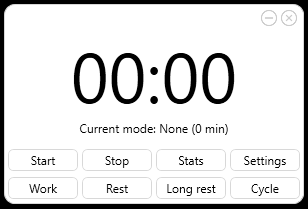
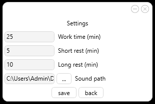
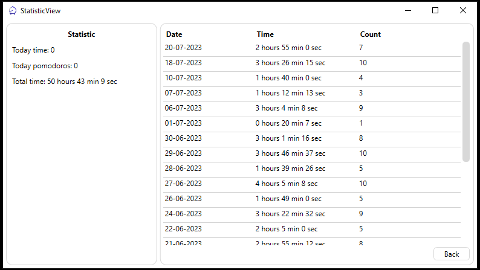

### About
Pomodoro Work Timer is a simple Windows application for time tracking and saving statistics locally and securely.

### Functionality
- After stopping the timer before time is out, only the current duration time is saved.
- Set work/rest/long rest timer mode.
- Change the duration for each mode in settings.
- Check statistics.
- Cycle (work-rest-work) mode.

### Architecture
- Statistics are stored in the Data folder in binary files. (one file for one day) 
- For notification sounds only .wav files are acceptable. 
- The app was built on the MVVM architecture pattern.
